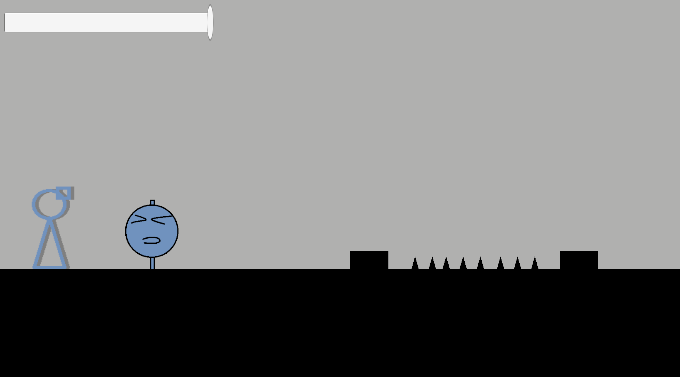

ゲーム制作技術総合実習 個人ワーク
（Circle, Triangle, Squareを使用した2Dゲーム）

# Monolith

## ゲームの内容
シンプルな2Dアクションゲームで各ステージのゴールを目指す。
ダメージを食らうと最初からやり直しなので気を付けて進まなければいけない。

## 操作説明
- 矢印キー、若しくはA、Dキーで左右に移動する
- スペースキーでジャンプする
- Fキーで会話を行うことができる
